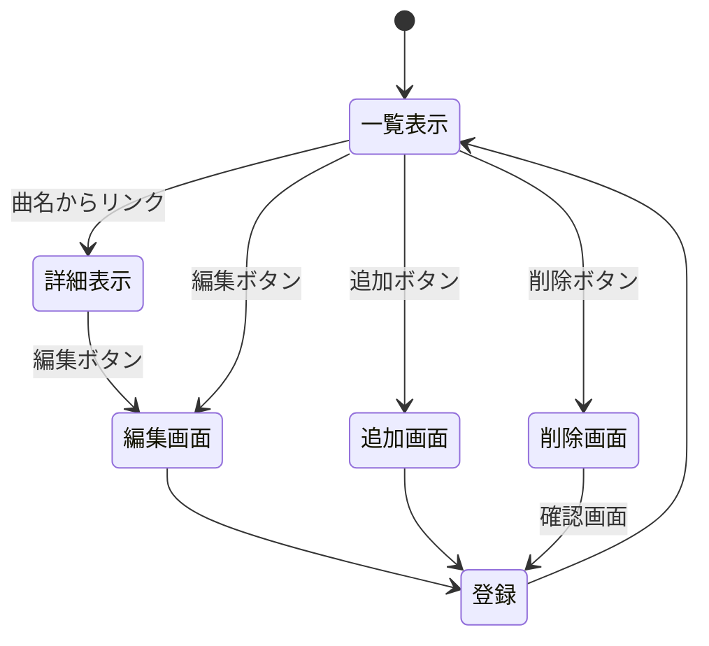

### 開発者用仕様書

# ボカロ曲システム

### システム概要
　本システムは，vocaloid楽曲の詳細情報を表示すシステムの開発を行ったものである．

### スキーム

項目名 | 型 | 内容 |
-|-|-
url | 文字列 | 曲URL
name | 文字列 | 曲名 
plays | 数値 | 再生数
day | 文字列 | 投稿日
contributor | 文字列 |  投稿者
lyricist | 文字列 | 作詞者
composer | 文字列 | 作曲者
illustrator | 文字列 | イラストレーター
movie | 文字列 | Movie

### ページ遷移の詳細

### システム構造

未定